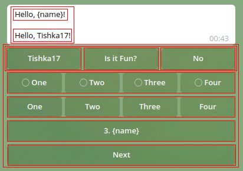

### Quickstart

1. Install:

```bash
pip install git+https://github.com/Tishka17/aiogram_dialog.git
```

2. See [examples](example)

3. If necessary, create custom controls like here: https://paste.ubuntu.com/p/zHwXGdgyqG/

### Usage

The concept of library based on three ideas:

1. Split data retrieving and message rendering
2. Unite rendering buttons and processing clicks
3. Better states routing

To start using the library you need to learn base kinds of objects:

UI:

* **Widget** - UI build block, such as text, button or group of elements
* **Window** - Single message. It consists of one or more widgets
* **Dialog** - Several windows in a line that share data and can be switched one to another

Technical:

* **DialogRegistry** - container of all your dialogs, used to register them in dispatcher
* **DialogManager** - main class used to manipulate dialogs in runtime
* **DialogContext** - storage of all your dialog data. Can be accessed via dialog manager instance

#### Declaring Window

Each window consists of:

* Text widget (`text=`). Renders text of message.
* Keyboard widget (`kbd=`). Render inline keyboard
* Data getter function (`getter=`). Loads data from any source which can be used in text/keyboard
* Message handler (`on_message=`). Called when user sends a message when window is shown
* State. Used when switching between windows

**Info:** always create `State` inside `StatesGroup`

A minimal window is:

```python
from aiogram.dispatcher.filters.state import StatesGroup, State
from aiogram_dialog.widgets.text import Const
from aiogram_dialog import Window


class MySG(StatesGroup):
    main = State()


Window(
    Const("Hello, unknown person"),
    None,
    MySG.main,
),
```

More realistic example:

```python
from aiogram.dispatcher.filters.state import StatesGroup, State
from aiogram_dialog.widgets.text import Format, Const
from aiogram_dialog.widgets.kbd import Button
from aiogram_dialog import Window


class MySG(StatesGroup):
    main = State()


async def get_data(**kwargs):
    return {"name": "world"}


Window(
    Format("Hello, {name}!"),
    Button(Const("Empty button"), id="nothing"),
    state=MySG.main,
    getter=get_data,
),
```

More complex window with multiple texts, button groups and selects can look like:


And if we draw red border around each widget it will be:



### Declaring dialog

Window itself can do nothing, just send message. To use it you need dialog:

```python
from aiogram.dispatcher.filters.state import StatesGroup, State
from aiogram_dialog import Dialog, Window


class MySG(StatesGroup):
    first = State()
    second = State()


dialog = Dialog(
    Window(..., state=MySG.first),
    Window(..., state=MySG.second),
)
```

**Info:** All windows in a dialog MUST have states from then same `StatesGroup`

After creating dialog you need to register it using `DialogRegistry`:

```python
from aiogram import Dispatcher
from aiogram_dialog import DialogRegistry

...
dp = Dispatcher(bot, storage=storage)  # create as usual
registry = DialogRegistry(dp)  # create registry
registry.register(name_dialog)  # create
```

**Info:** aiogram_dialog uses aiograms's FSM, so you need to create Dispatcher with suitable storage. Also avoid using
FSMContext directly

Then start dialog when you are ready to use it. Dialog is started via `start` method of `DialogManager` instance. You
should provide corresponding state to switch into (usually it is state of first window in dialog).

For example in `/start` command handler:

```python
@dp.message_handler(commands=["/start"])
async def user_start(message: Message, dialog_manager: DialogManager):
    await dialog_manager.start(MySG.first, reset_stack=True)
```

**Info:** Always set `reset_stack=True` in your top level start command. Otherwise, dialogs are stacked just as they do
on your mobile phone, so you can reach stackoverflow error

### Base widgets

Base widgets are `Whenable` and `Actionable`.

* `Whenable` can be hidden or shown when a condition is not satisfied. Condition is set via `when` parameter. 
  It can be either a data field name or a predicate
  
* `Actionable` is any widget with action (currently only any type of keyboard). It has `id` and can be found by that id. 
  It recommended for all stateful widgets (e.g Checkboxes) to have unique id within dialog. Buttons with different behavior also must have different ids. 

All currently implemented texts and keyboards are `Whenable`
All keyboards are also Actionable.

For picture above we have such widgets:


### Text widget types

Every time you need to render text use any of text widgets:

* `Const` - returns text with no midifications
* `Format` - formats text using `format` function. If used in window the data is retrived via `getter` funcion.
* `Multi` - multiple texts, joined with a separator (`sep=`)
* `Case` - shows one of texts based on condition

### Keyboard widget types

Each keyboard provides one or multiple inline buttons. Text on button is rendered using text widget

* `Button` - single inline button. User provided `on_click` method is called when it is clicked.
* `Group` - any group of keyboards. By default, they are rendered one above other. Also you can rearrange buttons in new rows of provided width
* `Row` - simplified version of group. All buttons placed in single row. 
* `Uri` - single inline button with uri
* `SwitchState` - switches window within a dialog using provided state
* `SwitchWindow` - switches window within a dialog to the provided window
* `Next`/`Back` - switches state forward or backward
* `Start` - starts a new dialog with no params
* `Cancel` - closes the current dialog with no result. An underlying dialog is shown
* `Select` - select one or multiple items. Items can be provided in constructor or passed from data getter of a window