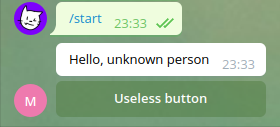

****************
Overview
****************

Concept
==================

Aiogram-dialog is a GUI framework for telegram bot. It is inspired by ideas of Android SDK and React.js

Main ideas are:

1. Split data retrieving and message rendering
2. Unite rendering buttons and processing clicks
3. Better states routing
4. Widgets

The main building block of your UI is **Window**. Each window represents a message sent to user and processing of a user reaction on it.

Each window consists of **Widgets** and callback functions. Widgets can represent message text and keyboard. Callbacks are used to retrieve required data or process user input.

You combine windows into **Dialog**. This allows you to switch between windows creating different scenarios of communication with user.

In more complex cases you can create more than one dialog. Then you can start new dialogs without closing previous one and automatically return back when it is closed. You can pass data between dialogs keeping they state isolated at the same time.

Quickstart
===============

Install library:

.. literalinclude:: examples/quickstart/install.sh

Create states group for your dialog:

.. literalinclude:: examples/quickstart/sg.py

Create at least one window with buttons or text:

.. literalinclude:: examples/quickstart/window.py

Create dialog with your windows:

.. literalinclude:: examples/quickstart/dialog.py

Let's assume that you have created your aiogram bot with dispatcher and states storage as you normally do.
It is important you have a storage because **aiogram_dialog** uses ``FSMContext`` internally to store it state:

.. literalinclude:: examples/quickstart/bot.py

To start using your dialog you need to register it. Also library needs some additional registartions for its internals.
To do it we will create **DialogRegistry** and use it to register our dialog

.. literalinclude:: examples/quickstart/register.py

At this point we have configured everything. But dialog won't start itself. We will create simple command handler to deal with it.
To start dialog we need **DialogManager** which is automatically injected by library. Also mind the ``reset_stack`` argument. The library can start multiple dialogs stacking one above other. Currently we do not want this feature, so we will reset stack on each start:

.. literalinclude:: examples/quickstart/start.py

Last step, you need to start your bot as usual:

.. literalinclude:: examples/quickstart/start_bot.py

Summary:

.. literalinclude:: examples/quickstart/summary.py

The result will look like:

