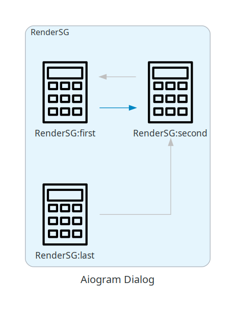
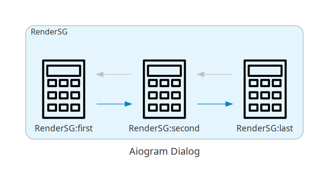

***********************************
Helper tools (experimental)
***********************************

State diagram
=================

You can generate image with your states and transitions.

Install library with tools extras:

.. literalinclude:: examples/tools/install.sh

Import rendering method:

.. literalinclude:: examples/tools/import.py

Call it passing your registry or list of dialogs:

.. literalinclude:: examples/tools/render.py

Run your code and you will get ``aiogram_dialog.png`` in working directory:

State transition hints
-------------------------

You may notice, that not all transitions are show on diagram.
This is because library cannot analyze source code of you callbacks.
Only transitions, done by special buttons are shown.

To fix this behavior you can set ``preview_add_transitions`` parameter of window:

.. literalinclude:: examples/tools/render.py

Run the code and check updated rendering result:

