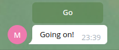
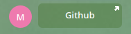
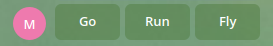
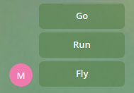
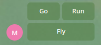
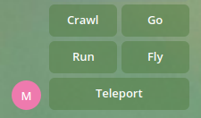
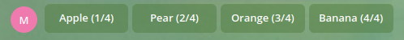
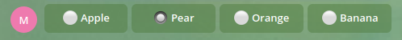
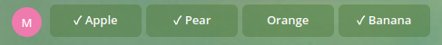

**********************
Widgets and rendering
**********************

Passing data
==================

Some widgets contain fixed text, others can show dynamic contents
For example:

* ``Const("Hello, {name}!")`` will be rendered as ``Hello, {name}!``
* ``Format("Hello, {name}!")`` will interpolate with window data and transformed to something like ``Hello, Tishka17!``

So, widgets can use data. But data must be loaded from somewhere. To do it Windows has `getter` attribute.
So let's create a function and use it to enrich our window with data.

.. note::

    In this and later examples we will skip common bot creation and dialog registration code unless it has notable differences with quickstart

.. literalinclude:: examples/widgets/getter.py

It will look like:

.. image:: resources/getter.png

Widget types
==================

Base information
********************

Currently there are 2 kinds of widgets: `texts <Text widget types_>`_ and `keyboards <Keyboard widget types_>`_.

* **Texts** used to render text anywhere in dialog. It can be message text, button title and so on.
* **Keyboards** represent parts of ``InlineKeyboard``

Also there are 2 general types:

* ``Whenable`` can be hidden or shown depending on data or some conditions. Currently al widgets are whenable.
  See: `Hiding widgets`_
* ``Actionable`` is any widget with action (currently only any type of keyboard). It has ``id`` and can be found by that id.
  It recommended for all stateful widgets (e.g Checkboxes) to have unique id within dialog.
  Buttons with different behavior also must have different ids.

.. note::

  Widget id can contain only ascii letters, numbers, underscore and dot symbol.

  * ``123``, ``com.mysite.id``, ``my_item`` - valid ids
  * ``hello world``, ``my:item``, ``птичка`` - invalid ids

Text widget types
*****************************

Every time you need to render text use any of text widgets:

* ``Const`` - returns text with no midifications
* ``Format`` - formats text using ``format`` function. If used in window the data is retrived via ``getter`` funcion.
* :ref:`Multi<multi_text>` - multiple texts, joined with a separator
* :ref:`Case<case_text>` - shows one of texts based on condition
* ``Progress`` - shows a progress bar
* ``Jinja`` - represents a HTML rendered using jinja2 template

Keyboard widget types
*****************************

Each keyboard provides one or multiple inline buttons. Text on button is rendered using text widget

* `Button`_ - single inline button. User provided ``on_click`` method is called when it is clicked.
* `Url`_ - single inline button with url
* :ref:`Group<group>` - any group of keyboards one above another or rearranging buttons.
* :ref:`Row<row>` - simplified version of group. All buttons placed in single row.
* :ref:`Column<column>` - another simplified version of group. All buttons placed in single column one per row.
* `Checkbox`_ - button with two states
* `Select`_ - dynamic group of buttons intended for selection use.
* `Radio`_ - switch between multiple items. Like select but stores chosen item and renders it differently.
* `Multiselect`_ - selection of multiple items. Like select/radio but stores all chosen items and renders them differently.
* ``SwitchState`` - switches window within a dialog using provided state
* ``Next``/``Back`` - switches state forward or backward
* ``Start`` - starts a new dialog with no params
* ``Cancel`` - closes the current dialog with no result. An underlying dialog is shown

Combining texts
=================

.. _multi_text:

To combine multiple texts you can use ``Multi`` widget. You can use any texts inside it. Also you can provide a string separator

.. literalinclude:: examples/widgets/multi.py

.. _case_text:

To select one of the texts depending on some condition you should use ``Case``.
The condition can be either a data key or a function:

.. literalinclude:: examples/widgets/case.py

Keyboards
================

Button
*************

In simple case you can use keyboard consisting of single button. Button consts of text, id, on-click callback and when condition.

Text can be any ``Text`` widget, that represents plain text. It will receive window data so you button will have dynamic caption

Callback is normal async function. It is called when user clicks a button
Unlike normal handlers you should not call callback.answer(), as it is done automatically.

.. literalinclude:: examples/widgets/button.py

If it is unclear to you where to put button, check :ref:`quickstart`

Url
*****

Url represents a button with an url. It has no callbacks because telegram does not provide any notifications on click.

Url itself can be any text (including ``Const`` or ``Format``)

.. literalinclude:: examples/widgets/url.py

Grouping buttons
******************

Normally you will have more than one button in your keyboard.

Simplest way to deal with it - unite multiple buttons in a ``Row``, ``Column`` or other ``Group``. All these widgets can be used anywhere you can place a button.

.. _row:

**Row** widget is used to place all buttons inside single row.
You can place any keyboard widgets inside it (for example buttons or groups) and it will ignore any hierarchy and just place telegram buttons in a row.

.. literalinclude:: examples/widgets/row.py

.. _column:

**Column** widget is like a row, but places everything in a column, also ignoring hierarchy.

.. literalinclude:: examples/widgets/column.py

.. _group:

**Group** widget does more complex unions. By default, it places one keyboard below another. For example, you can stack multiple rows (or groups, or whatever)

.. literalinclude:: examples/widgets/group.py

Also it can be used to produce rows of fixed width. To do it set ``keep_rows=False`` and ``width`` to desired value. Honestly, ``Row`` and ``Column`` widgets are groups with disabled ``keep_rows``

.. literalinclude:: examples/widgets/group_width.py

Checkbox
**************

Some of the widgets are stateful. They have some state which is affected by on user clicks.

On of such widgets is **Checkbox**. It can be in checked and unchecked state represented by two texts.
On each click it inverses its state.

If a dialog with checkbox is visible, you can check its state by calling ``is_checked`` method and change it calling ``set_checked``

As button has ``on_click`` callback, checkbox has ``on_state_changed`` which is called each time state switched regardless the reason

.. literalinclude:: examples/widgets/checkbox.py

.. image:: resources/checkbox_checked.png
.. image:: resources/checkbox_unchecked.png

.. note::

    State of widget is stored separately for each separate opened dialog. But all windows in dialog share same storage. So, multiple widgets with same id will share state.
    But at the same time if you open several copies of same dialogs they will not mix their states

Select
**********

**Select** acts like a group of buttons but data is provided dynamically.
It is mainly intended to use for selection a item from a list.

Normally text of selection buttons is dynamic (e.g. ``Format``).
During rendering an item text, it is passed a dictionary with:

* ``item`` - current item itself
* ``data`` - original window data
* ``pos`` - position of item in current items list starting from 1
* ``pos0`` - position starting from 0

So the main required thing is items. Normally it is a string with key in your window data. The value by this key must be a collection of any objects.
If you have a static list of items you can pass it directly to a select widget instead of providing data key.

Next important thing is ids. Besides a widget id you need a function which can return id (string or integer type) for any item.

.. literalinclude:: examples/widgets/select.py

.. note::

    Select places everything in single row. If it is not suitable for your case - simply wrap it with `Group`_ or `Column`_

Radio
********

**Radio** is staeful version of select widget. It marks each clicked item as checked deselecting others.
It stores which item is selected so it can be accessed later

Unlike for the ``Select`` you need two texts. First one is used to render checked item, second one is for unchecked.  Passed data is the same as for ``Select``

Unlike in normal buttons and window they are used to render an item, but not the window data itself.

Also you can provide ``on_state_changed`` callback function. It will be called when selected item is changed.

.. literalinclude:: examples/widgets/radio.py

Useful methods:

* ``get_checked`` - returns an id of selected items
* ``is_checked`` - returns if certain id is currently selected
* ``set_checked`` - sets the selected item by id

Multiselect
************

**Multiselect** is another kind of stateful selection widget.
It very similar to ``Radio`` but remembers multiple selected items

Same as for ``Radio`` you should pass two texts (for checked and unchecked items). Passed data is the same as for ``Select``

.. literalinclude:: examples/widgets/multiselect.py

After few clicks it will look like:

Other useful options are:

* ``min_selected`` - limits minimal number of selected items ignoring clicks if this restriction is violated. It does not affect initial state.
* ``max_selected`` - limits maximal number of selected items
* ``on_state_changed`` - callback function. Called when item changes selected state

To work with selection you can use this methods:

* ``get_checked`` - returns a list of ids of all selected items
* ``is_checked`` - returns if certain id is currently selected
* ``set_checked`` - changes selection state of provided id
* ``reset_checked`` - resets all checked items to unchecked state

.. warning::

    ``Select`` widgets stores state of all checked items even if they disappear from window data.
    It is very useful when you have pagination, but might be unexpected when data is really removed.

Hiding widgets
====================

