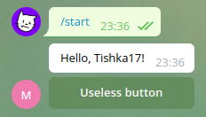

**********************
Widgets and rendering
**********************

Passing data
==================

Some widgets contain fixed text, others can show dynamic contents
For example:

* ``Const("Hello, {name}!")`` will be rendered as ``Hello, {name}!``
* ``Format("Hello, {name}!")`` will interpolate with window data and transformed to something like ``Hello, Tishka17!``

So, widgets can use data. But data must be loaded from somewhere. To do it Windows has `getter` attribute.
So let's create a function and use it to enrich our window with data.

.. note::

    In this and later examples we will skip common bot creation and dialog registration code unless it has notable differences with quickstart

.. literalinclude:: examples/widgets/getter.py

It will look like:

